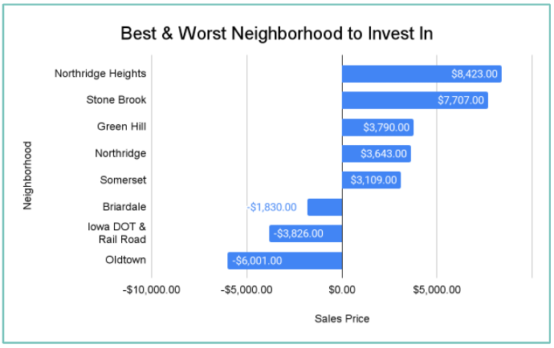

# Project 2: Analysis of Ames Housing Data
## By: Leticia G.

### Problem Statement

Already placed as the 64th best city to live in the US according to a study by Livability, Ames, Iowa is a popular living destination for Americans. Close to Iowa State University, it is a popular place for graduates and families to settle down. This project aims to explore trends in Ames, Iowa housing data and seeks to identify housing features that increase the Sale Price of a house. This would allow real estate investors to better invest in the houses being built and get the most bang for their buck.

### Background Research: What factors would affect house price?

Some of the most important factors when it comes to buying a house is the size of the house, location (nice area vs bad area, school area, close to work etc - neighborhood variable), number of beds and bath, year built, garage (88% of Americans have access to a car - Pew Research Center 2015), and yard size.

Special features like paved driveway (alley variable), pool, backyard, ac unit/heating, basement, fireplace, and condition and quality of the house, garage, kitchen, fireplace, garage are also attractive features to some home buyers.

However, let's see which of these features actually increase the Sales Price of homes in Ames, Iowa.

### Data Dictionary 
Below is a data dictionary explaining all the features used in my project and analysis.

|Feature|Type|Dataset|Description|
|---|---|---|---|
|**Overall Qual**|*int64*|df_train|Overall material and finish quality| 
|**Gr Liv Area**|*int64*|df_train| Above grade (ground) living area square feet.|
|**1st_Fl_SF_Tot_BSMT_S**|*int64*|df_train|The interaction term of First Floor square feet to Total square feet of basement area| 
|**Garage_CarsGarage_Area**|*int64*|df_train|The interaction term of number of garage cars to the area of the garage| 
|**Fireplaces**|*int64*|df_train|Number of fireplaces| 
|**Open Porch SF**|*int64*|df_train|Open porch area in square feet.| 
|**Wood Deck SF**|*int64*|df_train|Wood deck area in square feet| 
|**Lot Area**|*int64*|df_train| Lot size in square feet| 
|**Bsmt Full Bath**|*int64*|df_train| Basement full bathrooms| 
|**Dummy Coded Neighborhood variables**|*object*|df_train| Th neighborhoods in Ames, Iowa dummy coded|

### Summary of Analysis

After cleaning, plotting, and numerous (ols, ridge, lasso) model testing, the model I found that provided the lowest training and test RMSE, and highest adj r2 scores was my scaled Ridge Regression model. It consists of the dummy coded neighborhood variables,  interaction terms based on correlation, and the features with the highest correlation to sales price. I focused on the interaction terms and did additional external research on what the lifestyle is like for people in Ames, Iowa to see if the interaction terms can sensibly fit into their lifestyle they did. Now, I used ridge because it reduced the overfit of my model and punished any potential multicollinearity. Ultimately, it improved my model RMSE test by $3K and improved my R2 as well from my basic OLS. The Model comparison is pictured below.

____

____
#### Feature Plot Before Checking of Coefficients

After plotting coefficients, and p value interpretation it was evident Overall Quality and Ground Living area had the highest affect to Sales Price, followed by the interaction terms, Basement Full Bath, Wood deck SF, Lot Area, Open Porch SF, and Fireplaces. Additionally, external research showed Fireplaces are one of the features that improve property value. With an average winter temperature of 14 degrees Fahrenheit, a fire place is an attarctive feature for home buyers.

#### Features Selected Based on Statistical Significance of Coefficients

The interpretation of the coefficients helped determine which of my neighborhoods had a significant postive (Northridge Heights, Stone Brook, Green Hill, Northridge, and Somerset) or negative (OldTown, Briardale,IDOT&RR) impact on Sales Price. While many had high impacts on price, only a few were statistically significant. I did additional research as to why these three neighborhoods decreased Sales Price so much and found Old Town is a historically preserved area in Ames, Iowa and residents tend to avoid living in this neighborhood as there are many constructing restrictions. Briardale is close to a noisy highway and not an ideal area for families in Iowa, which is the same complaint the Iowa Dot and RR neighborhood has as its close to the railroad.

To conclude my findings, the feature that improved Sales Price the most was Overall Quality - The criteria for determining the finish quality of the home should be carefully considered since the potential return can be the biggest. Having an adequate sized garage that can fit more than one vehicle is essential to homeowners in Iowa since most American families have access to more than one vehicle, and driving is the common mode of transportation in Ames. Homeowners transform their basements into bedrooms, entertainment rooms, game rooms and more - having access to a full bathroom in the basement is a highly sought after feature. Lastly, an area to especially consider would be the square footage of the first floor and basement together as this showed to have a significant increase to the final Sales Price.  A common theme from basement, to porch, to deck, to lot size, to first floor area is large square footage. Having a roomy house big enough for a family our couple looking to grow is key factor in determining Sales Price.

### Conclusions and Recommendations

-  The overall material and finish quality of a home is the most important feature affecting Sales Price.
-  Having an a big garage that can fit more than one car improves Sales Price greatly
-  A full bath in the basement is one of the most valuable additions to a house.
-  A fire place is a great appeal for houses in Ames, Iowa
-  Location can greatly increase or decrease the final sale price of the home

My recommendation to real estate investors is to pay special mind to the overall material and finish quality of the home as these quality indicators affect Sale Price the most. Next, focus on location. Northridge Heights, Stone Brook, Green Hill, Northridge, and Somerset are highly valued areas so investing in homes in these neighborhoods will have a positive return on investment. Northridge, Stone Brook, and Somerset are close to Schilletter-University, and  Greenhill is close to Iowa State University increasing the value of these neighborhoods.

Structure wise homes with adequate garage space for families with multiple vehicles, a full bathroom in the basement, a fireplace, the sq ft of the above ground floor level, the sq ft of the first floor in combination with the square footage of the basement, lot size sq ft, wood deck sq ft, and open porch sq ft all are features that are highly valued. The common theme seems to be adequate square footage for families to move around. Neighborhoods that should not be focused include Oldtown (historically preserved area), Briardale (close to noisy highway), Iowa DOT and Rail Road (close to noisy railroad) as they bring down the price of the home. 

My additional research showed that in Ames, Iowa on average home owners own 2 cars, and one of the most attractive features for home owners is a fireplace. I recommend a future study diving into the data regarding features home owners find attractive and desire specifically in Ames, Iowa. A suggestion would to develop survey data to aid in determining what are sought after features currently not offered in the market.

### Sources
- https://www.ortalheat.com/blog/which-features-do-americans-want-in-their-dream-home-hint-a-fireplace-is-on-the-list
- https://eyeonhousing.org/2019/09/share-of-new-homes-with-fireplaces-drops-to-record-low/
- https://datausa.io/profile/geo/ames-ia/
- https://livability.com/best-places/2021-top-100-best-places-to-live-in-america/top-100-2021-ames-ia/
- https://www.desmoinesregister.com/story/news/2021/10/22/livability-lists-three-iowa-cities-top-100-best-places-live-des-moines-ames-iowa-city/6123796001/
- https://policyadvice.net/insurance/insights/how-many-americans-own-cars/
- https://www.google.com/maps