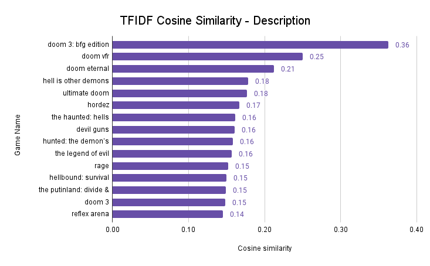
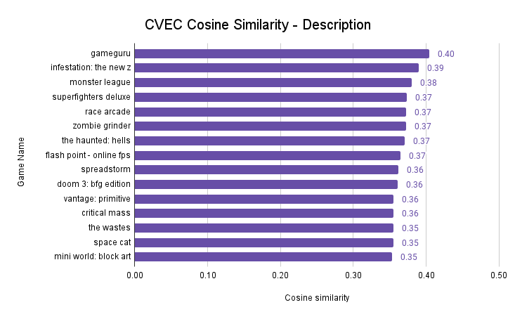
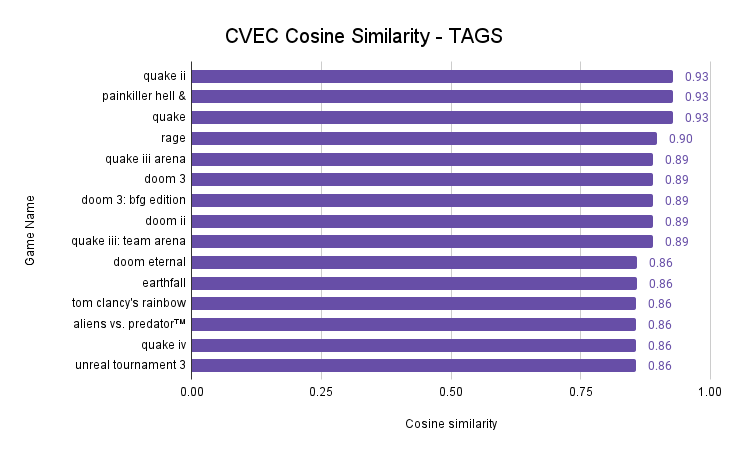

## What Should I Play? - Steam Video Game Content Recommendation System
#### By: _Leticia Genao_

- [Problem Statement](#1)
- [Background Info and Outside Research](#2)
- [Approach](#3)
- [Data Information](#4)
- [Data Dictionary](#5)
- [EDA](#6)
- [Recommender System Comparisons](#7)
- [Summary of Analysis](#8)
- [Conclusions and Recommendations](#9)
- [Future Considerations](#10)
- [Sources](#11)

# Problem Statement: 
With many video games retailers in the market, the competition to retain customers is highly competitive with multiple platforms available for games to purchase and play through.  With various choices to make, keeping customers buying games from your platform is essential.  This project aims to develop a video game recommendation system for Steam users to input their favorite video game title and have similar games suggested in order to keep users from switching to other platforms such as Epic Games, OP.GG, Quixant, GOG, Humble Store, Itch.io, and Fanatical. Besides forming the recommender system, NLP will be used on the game description and used as feature in the system. This recommender system will be measured by cosine similarity scores.

This recommender system is based on a contextual strategy using the description, genre, game details, and tags. Null values were dropped from the dataframe.

## Background Info and Outside Research: 
According to an article by Stephen Totilo, author of Axios Gaming,  Steam leans on users’ [curation pages](https://store.steampowered.com/curators/topcurators/) and player reviews on the games themselves to raise awareness for games on their platform (Totilo, 2022). While users reviews and custom recommendation are an engaging way for users to submit their opinions and recommend titles to other players, what do you do when someone hasn't reviewed a game you want to push? That's where a content recommender system will come in handy.

Additionally, Steam's [current](https://store.steampowered.com/recommender/76561199115116270) game recommendation system has limited capabilities. You can only search by tag, age, and popularity.

## Approach: 
Note: Game title tested in system: "Doom", an action, gore, horror based game that is said to have pioneered first-person-shooters.

- Description Based Recommender Systems
  - TFIDF Vectorizer:  As TFIDF negates high frequency words we aim to find distinct insightful text using English and custom stopwords.  Comparison of cosine similarities  on the text description with relevant recommendations with be evaluation.  Final Shape: (20969, 70143)

  - Countvectorizer:  Conversely, I wanted to test using commonality between descriptions to see how the cosine similarity scores compared to the recommended TFIDF scores.

- Metasoup Tag Based Recommender System
  - Countvectorizer:  Unlike with TFIDF, which negates high frequency words, we desire the emphasis on frequently occurring tags to base the recommendations on. The additional weights of countvectorizer will improve our recommendations so this will be paired with searching over the first 3-5 weighted tags of each feature while combining tags into a metasoup of text testing English and custom stopwords for score improvement.

## Data Information: 
- **Rows** 40,832 (initial data)
- **Final Rows** 20,969
- **Initial Columns**: 20
- **Final Column**: 70,143 if TFIDF,  14,899 if CVEC
- **Model Type** Content Based Recommender System
- **Data Source**  
   - https://www.kaggle.com/datasets/trolukovich/steam-games-complete-dataset

## Data Dictionary: 
   Below is a data dictionary explaining all the features used in the project and analysis.

   |Feature|Type|Description|
   |---|---|---|
   |**name**|*obj*|The title of the video game|
   |**developer**|*obj*| The developer of the video game|
   |**popular_tags**|*obj*| The tags of the video games such as survival and shooter|
   |**game_details**|*obj*|The details if the game such as multiplayer, online, captioned etc|
   |**genre**|*obj*|The genre of the video game such as action, indie, or adventure|
   |**date_year**|*int64*|The reformatted date the game was released|
   |**clean_price**|*float64*|A reformatted and cleaned version of the original price column|
   |**game_description_clean**|*obj*| A cleaned version of the full steam description of the video game|
   |**desc_length_clean**|*int64*| The numeric total of the character length of the description of the game|
   |**metasoup**|*obj*|The combination of the top 3-5 tags in the developer, popular_tags, game_details, and genre columns into a single clean text column |
   |**metasoup_length**|*int64*|The numeric total of the character length of the metasoup column|

## EDA: 

#### Distribution of Description Length

There's a big difference in the description length amongst all the games in the dataset. According to the histogram descriptions under about 2,500 are the popular length, while the lengthy detailed descriptions are under 5,000 characters long. There are a total 192 descriptions over 5,000 characters. The distribution is left leaning.

#### Distribution of Metasoup Length

Interesting enough it seamed the length of the metasoup is following a bit of a normal distribution type shape with most of the values residing in the center around 90 characters long and fanning outward in both directions.

#### Unigrams - Top 25 Unigrams in Game Description

With the parameters chosen for cvec (min_df = 3, max_df = .90, max_features = 5000, stop_words = custom), some descriptive words like world, experience, adventure, weapon, and explore yield high frequency results. This provides a general idea about the how the descriptions are commonly worded, but a closer look at bigrams for further details is needed.

#### Bigrams - Top 25 Bigrams in Game Description

Now, the bigrams gives a better perspective with key words such as "real time", "fast paced", "turn based", "open world", and "virtual reality" coming in at the top five. Some unique findings are bigrams like "old school", " htc vive", "early access" showing what type of games are described in the dataset. As there is a high frequency of these words, this could provide a good insight for steam's video game recommendation team to suggest more games in this category to encourage purchases or branch out to implement a broader variety.

#### Trigrams - Top 25 Trigrams in Game Description

Finally, tri-grams demonstrates even more insight into the description of the games. "Real time strategy", "point click adventure", "turn based combat", and "turn based strategy" were the top four trigrams in the dataset. "Trading card games", "special collector edition", and trigrams involving adjectives of "exclusive", "extras", and "version" seem to be common features throughout the games. While the frequency of occurrence is smaller it gives more specialized insight into the language in the games descriptions.

## Recommender System Comparisons 
#### TFIDF on Game Description

This system returns the top 25 most similar games purely based on the description of the of games. However, 4 of the games are games in the doom series which a player most likely have played already. Whether English stop words or custom stop words are used, the cosine similarity scores stay the same in a range from 13-36% for the top 3 feature function. This recommender system version suggests games in the same franchise listing the other 3 Doom games first, but ranking dissimilar games like Chaordic and Reflex Arena high in the list. Lastly, the cosine similarity scores are pretty low. We need more information to generate better recommendations.
#### CVEC on Game Description

Countvec Description 3 features English stop words
- Interestingly enough, using the countvectorizer to find the commonality between descriptions yields higher cosine scores (34-40% range) than the TFIDF version (13-30% range). However, when the higher ranking game recommendations are manually inspected, they actually do not have much in common with the input game ('Doom') and would make for a poor recommendation system.

Countvec Description 3 features custom stop words
- When English stop words are removed, and only custom stop words are used, the cosine similarity scores range from 23-33%. Recommendations could be a hit or miss with some of the higher ranking ones being less relevant similarly to the English stop words version.
Note:
- Only the 3 feature system was tested as it yielded higher cosine scores across the systems.

#### CVEC on Metasoup Tags

Results of run with top 5 features custom stop words:
- Comparing the first recommended game score from both recommender systems, the tag-based system has a 147.11% increase in cosine-similarity score over the description based system. The top 25 recommendations in the tag-based recommendation system having an 71-83% or higher similarity score whereas the description based recommender system's top 25 ranged from 13% to 36% match. A manual inspection of the recommended games shows a high commonality with the input game, 'Doom' and the recommendations than the description based system. The relevancy of the game recommendations are good as well.

Results of run with top 5 features English stop words:
- With only English stop words used the cosine similarity scores range from 78-87% for the top 5 feature function. Games from the Quake and Doom series are the highest recommended. There are some misses like, "joint operations: combined arms gold" and "call of duty: black ops - mac edition" which are not similar to Doom.

Results of run with top 3 features custom stop words:
- When English stop words are removed, and only custom stop words are used the cosine similarity scores range from 78-89% for the top 3 feature function. This model version recommends games in the same franchise listing the other Doom games in a random order, and ranking similar games like Quake and Rage higher than without the custom stopwords. "Tom clancy's rainbow six® vegas 2" is still a miss as the game is not that similar to Doom, but contains similar tags such as FPS and Action.

Results of run with top 3 features English stop words: - Final - Best Recommender System
- After changing the get_list function to prioritize the top 3 features in a list there was a 155.55% increase in cosine-similarity compared to the description only recommender system. That's a 8.44% increase in cosine similarity compared to the run with 5 feature prioritization. The cosine similarity scores in this recommender system range from 84-92%. The game 'painkiller hell & damnation' has a perfect cosine-similarity score of 92% as its top three tags, game details, and genre were a very high perfect match to the input game of 'Doom'. A score of 1 or 100% means there is zero distance between the scoring of the games and they are identical. As this system has the highest cosine similarity scores and the recommendations are highly relevant, this will be the final recommender system.

## Summary of Analysis: 
After cleaning (dropping nulls, reformatting columns), plotting, and running the three different content recommender system (TFIDF and CVEC based) on game description and a metasoup of tags, the CVEC tag based system returned the highest cosine-similarity scores. The final corpus sized used for the CVEC metasoup recommender system was 14,899. When inspected manually, the recommendations relevant for the game inputted into the system.

Analyzing the various games tested in the CVEC systems, relevant recommendations contained cosine-similarity ranging from 70-98%. On the contrary, the TFIDF recommender had the lowest scores which is surprising as it is a very popular tool for content recommender system. Closer analysis will be done in the future to gain a better understanding why it did poorly on the game data.

## Conclusions and Recommendations: 
- The best recommender system was a **countvectorizer using the features of developer, popular_tags, game_details, and genre with a 3 weight tag prioritization and English stop words**. This yielded not only highest cosine similarity scores, but also stood up to manual inspection as the games recommended were relevant and matched the inputted game very closely. This system had a 155.55% increase in cosine similarity for the first recommended game in comparison to the baseline TFIDF recommender system.

- TFIDF vectorizer which is known to be a popular metric to use for description based content recommender systems had the lowest cosine scores. The reasoning could be the the weighting of the frequently occurring word, it may have decreased the score. This system needs improvement.

- The countvec description recommender yielded higher cosine similarity scores than the TFIDF, but more irrelevant recommendations when manually inspected. This could be as the countvectorizer is weighing the non-unique common words higher thus incorrectly recommending other games.

For description based recommender system, cosine with TFIDF for uniqueness is a popular approach, but the best model will be the tags based recommender system with countvectorizer as the weighted tags provides more useful information for the system. The game recommendations yield higher scores and the recommendations are relevant.

## Future Considerations: 
A possibility could be to do a combination model with the metasoup of tags and the description combined to feed the system more information. A system of weighted tags and unweighted descriptions could provide even more specific recommendations.

Recommendations also could include adding mature rating scores as a tag, user rating scores from metacritic, and calculating an average positive rating score from the data present (all_reviews feature in initial dataset) to create a collaborative system with the scoring and NLP on the text. The addition of user rating will aid in recommending highly received games, and not just similar games which is limited to how descriptive the text or tags are.

Additionally, adding a price bucket tier would make the system more useful to customers. A system with option tag selection search would make the process customizable to the user's specific taste in the moment. Finally, with a collaborative system containing more complicated algorithms such as PCA and SVD, establishing a baseline and generating predictions the data would increase the accuracy and usability of the system and should be looked into.

## Sources: 

- ALEXANDER ANTONOV, (2019). Steam games complete dataset.  https://www.kaggle.com/datasets/trolukovich/steam-games-complete-dataset
- F.O. Isinkaye, Y.O. Folajimi, B.A. Ojokoh, (2015). Recommendation systems: Principles, methods and evaluation. Egyptian Informatics Journal, Pages 261-273. https://doi.org/10.1016/j.eij.2015.06.005
- G. Shani, A. Gunawardana. (2009). MSR-TR-2009-159, Evaluating Recommender Systems https://www.microsoft.com/en-us/research/wp-content/uploads/2016/02/EvaluationMetrics.TR_.pdf
- Steam history - https://www.statista.com/topics/4282/steam/
- Steam facts -  https://www.statista.com/statistics/308330/number-stream-users/#:~:text=Steam%20had%20approximately%20120%20million,monthly%20active%20users%20in%202019.
- Steam facts - https://www.statista.com/statistics/308330/number-stream-users/#:~:text=Steam%20had%20approximately%20120%20million,monthly%20active%20users%20in%202019.
