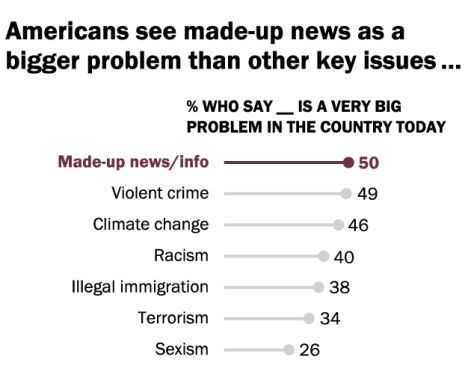
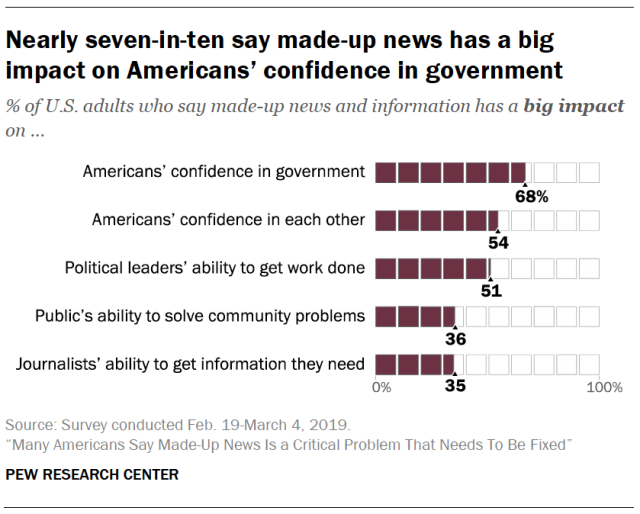
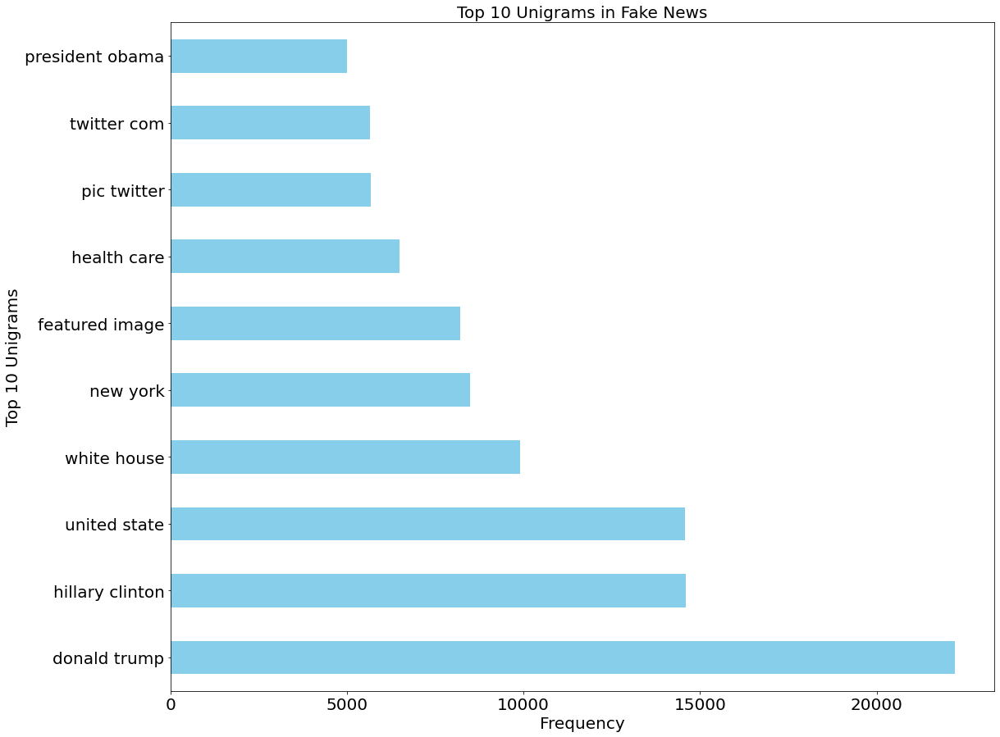
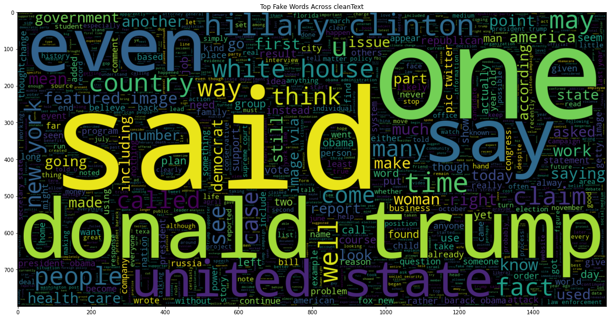
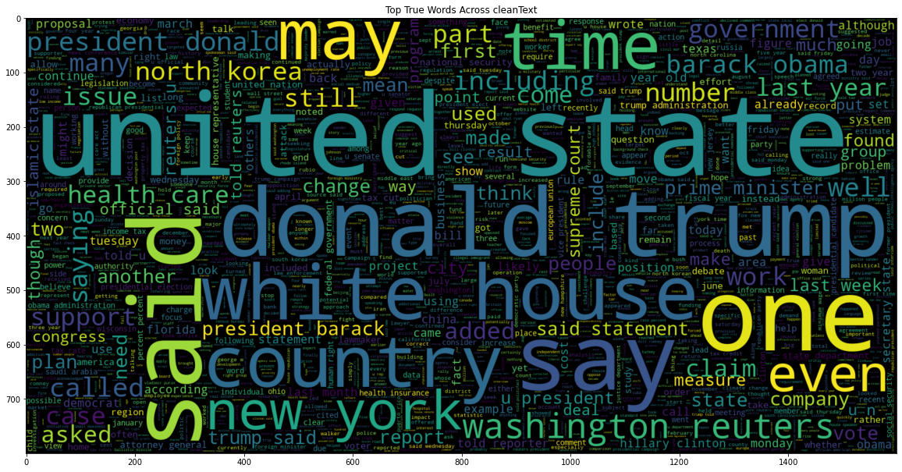
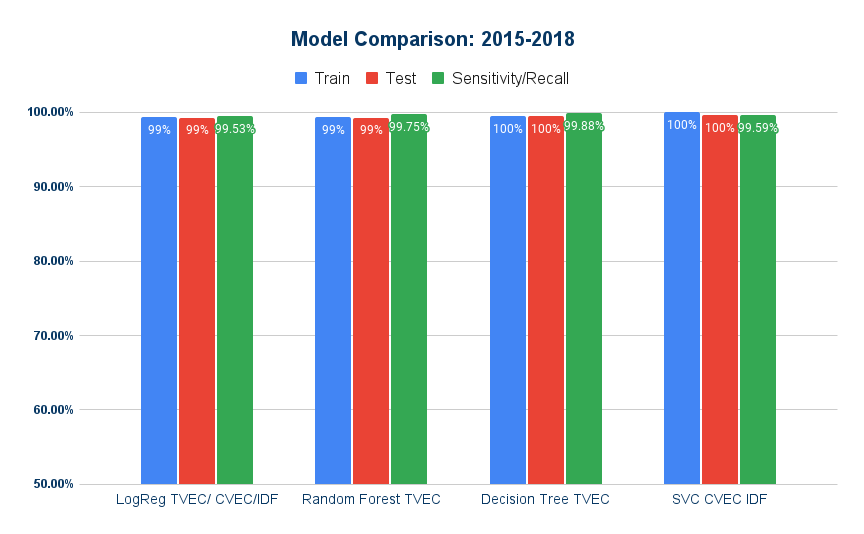
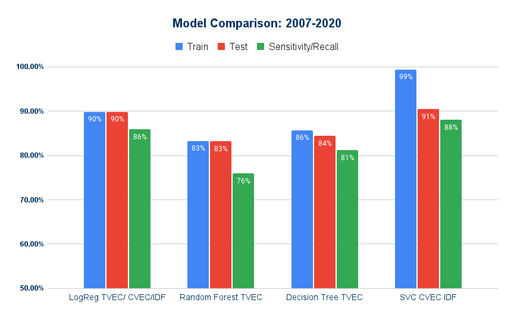
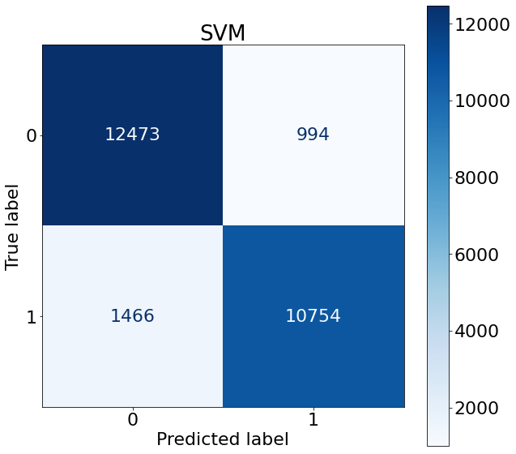

## By Team 1: The East-West Alliance
Team Members: Nicolas Carreras, Leticia Genao, Kevin Peng, and Molovi Shuba

### Table of Contents
- [Problem Statement](#1)
- [Background Info and Outside Research](#2)
- [Methodology](#3)
- [Data Information](#4)
- [Data Dictionary](#5)
- [EDA](#6)
- [Summary of Analysis](#7)
- [Conclusions and Recommendations](#8)
- [What's next? - Future study/research](#9)
- [Sources](#10)

## Problem Statement: 
The Society of Professional Journalists hired The East-West Alliance (TEWA) as consultants to create a model that predicts and classifies articles as either fake or real based on the title and content of the news article. The goal aims to mitigate the spread of misinformation and promote accountability in the media.  It would help out social media sites like Facebook and Twitter to filter out spam and/or fake stories that would make a culpable person believe them.

## Background Info and Outside Research: 

According to a survey done of 6,000 by Pew Research Center, Americans find fake news and the spread of misinformation as bigger problems in the country than violent crime, climate change, racism, terrorism, and sexism. 70% of respondents stated fake news impacts their belief in their government and 54% said it affects their confidence in their fellow Americans. Misinformation spreads quickly through social media with 45% of U.S. adults using Facebook specifically for their daily news intake and 25% using two or more social media websites. Even a whopping 60% of survey respondents admitted to accidentally sharing fake news on social media. 73% of respondents said they see the most fake news surrounding the topics of elections/politics.

Pew Research reported that over half of the respondents of the survey wished for spreading fake news to be a punishable crime. With Americans ranking the spread of fake news as a huge problem, even spreading misinformation themselves, creating an application where political text can be checked before being shared would help Americans feel more confident in each other, the government, and the damage of spreading misinformation.

## Methodology: 
1. Gather the initial data
2. Performed EDA
3. Create models using grid-search
4. Run models
5. Evaluate models/pickle models
6. Create streamlit application
7. Gather new data to retrain our models/load into streamlit application

## Data Information: 
- **Rows** 44,898 (initial data) + 63,062 (additional data) = 107,960
- **Final Rows** 77,838
- **Initial Columns**: 4
- **Final Column**: 1
- **Model Type** Binary Classification
- **Data Source**  
   - https://www.kaggle.com/datasets/clmentbisaillon/fake-and-real-news-dataset
- **Additional Data Sources**
  - https://doi.org/10.34740/KAGGLE/DSV/911  
  - https://www.kaggle.com/datasets/rmisra/news-category-dataset 
  - https://dx.doi.org/10.21227/fbzd-sw81

## Data Dictionary: 
Below is a data dictionary explaining all the features used in our project and analysis.

|Feature|Type|Dataset|Description|
|---|---|---|---|
|**title**|*obj*|True|The title of the news article| 
|**text**|*obj*|True| The body text of the article|
|**all_text**|*obj*|True| New feature combining article titles and body|
|**subject**|*obj*|True| The subject of the article (political or world news)| 
|**date**|*obj*|True|The date the article was created| 
|**title**|*obj*|Fake|The title of the news article| 
|**text**|*obj*|Fake| The body text of the article|
|**all_text**|*obj*|Fake| New feature combining article titles and body|
|**subject**|*obj*|Fake| The subject of the article (middle-east, US_news, left-news, Government News, politics, News)| 
|**date**|*obj*|Fake|The date the article was created| 
|**cleantext**|*obj*|Full_df|The preprocessed and cleaned text that was the final feature for the model | 

## EDA: 

#### Unigrams - Fake

After running our model through the fake data we found the word “trump” as being the highest indicator of fake news at over 100,000 occurrences, “said” is the second at over 80,000 occurrences.

#### Bigrams - Fake

Looking at bi-grams the top indicators of fake news were ”Donald Trump”, “Hilary Clinton”, “United States”, and “White House”. The words “featured image” and “pic Twitter” indicates if a picture was attached then the news was most likely to be fake.

#### Word Clouds - Fake and True

The true words were similar to fake but the frequency of occurrence changed. “Said” is not as big of an indicator of true as it is in the fake word cloud, but contained key differences such as “Reuters” and “Washington”.

#### Model Comparison - Initial & Reran

Our initial dataset contains data from 2015 to 2018, and the models performed very similar across the board with minimal differences in training, test, and sensitivity. Our top four models had near-perfect scores across the evaluation metrics chosen.

To make our models more robust we found additional political data from 2007 to 2020 and reran our models. This had a great effect on the training, test, and sensitivity scores. Random forest had the biggest drop in sensitivity at 23% followed by a decision tree at 18%, logistic regression at 13%, and SVC at 11%. While all the models had test score drops ranging from 9-16%, SVC had a training score drop of 1% indicates the model is overfitting and will require future adjustments before deployment.

#### SVC Confusion Matrix

Our true positives were 10,754 correctly identified fake news. Our true negatives were 12,473 correctly identified true news. The SVC mislabeled 1,466 false negatives or fake news misidentified as true, and 994 false positives or true news misidentified as fake. Even with the small amount of misidentification, our model still predicts with 90%  accuracy and has a low threshold for type 2 errors.

#### Summary of Analysis: 
The corpus size used to train and test on our models was about 77k+ which was mainly gathered from data that was already downloaded/collected via Kaggle. After cleaning (dropping nulls, reformatting columns), plotting, and running numerous models (Logistic Regression, Random Forest, Decision Tree, SVC, KNN, Naive Bayes) to test for fake data the train, test, and sensitivity scores were the following:

|           Model Name          | Train Set | Test Set | Sensitivity/Recall |
|:-----------------------------:|:---------:|:--------:|:------------------:|
|  Logistic Regression CVECIDF  |    90%    |    90%   |         86%        |
|       Random Forest TVEC      |    83%    |    83%   |         76%        |
| Decision Tree Classifier TVEC |    86%    |    84%   |         81%        |
|          SVC CVECIDF          |    99%    |    91%   |         88%        |
|            KNN TVEC           |    90%    |    74%   |         66%        |
|        Naive Bayes TVEC       |    79%    |    78%   |         69%        |

After transforming our data through either count-vectorizer or IDF and grid-searching for the best hyperparameters on each model, SVC came out on top with the best testing score of 91% and had the best sensitivity score correctly identifying fake news 88% of the time. We believe this is due to the nature of SVC having proven to do very well with the hyperparameters of a degree of 2 with a radial basis function (RBF) kernel, thus it is our chosen best model. On the contrary, we found the worst performing model with the biggest variance difference between train and test was KNN at 16%. It also had the lowest sensitivity score of 66%. It was not able to accurately classify fake data were a mere accuracy score of 74%.

## Conclusions and Recommendations: 
In conclusion, we would want to go with SVC as our final model to classify news data. We want to go with SVC as not only does it have the highest accuracy score, but also the best sensitivity score of 88% where it will correctly identify fake news to be fake 88% of the time! Our priority is to correctly capture fake news to minimize the harmful spread of misinformation and the SVC model's high sensitivity score allows for just that.

## What's next? - Future study/research: 
- Update models quarterly from NEWs API site to maintain a rigorous model 
- Fine-tune the classification app to meet user needs
    - Add features to the app such as adding article links directly into the text box for verification or the ability to share from the application with truth verification.
- More NLP Analysis and establish a custom word list
- Refine the preprocessing of text data using more advanced RegEx techniques
- Maintain Streamlit application
- Separate models for different subjects/topics

## Sources: 
- H, T. I., & S, S. (2017, ). (2017) “Detection of Online Fake News Using N-Gram Analysis and Machine Learning Techniques. Retrieved 10618

- Megan Risdal. (2016). <i>Getting Real about Fake News</i> [Data set]. Kaggle. https://doi.org/10.34740/KAGGLE/DSV/911

- Rishabh Misra (2019). <i>News Category Dataset</i>[Data set]. Kaggle. https://www.kaggle.com/datasets/rmisra/news-category-dataset

- Fariba Sadeghi, Amir Jalaly Bidgoly, Hossein Amirkhani. (2020). FNID: Fake News Inference Dataset. IEEE Dataport. https://dx.doi.org/10.21227/fbzd-sw81

- Lans, S. van der. (2021, March 26). Council post: Buzzword or real threat? Fake news is more dangerous than you think. Forbes. Retrieved from https://www.forbes.com/sites/forbestechcouncil/2021/03/26/buzzword-or-real-threat-fake-news-is-more-dangerous-than-you-think/?sh=60c12f043a5f

- Mitchell, A., Gottfried, J., Stocking, G., Walker, M., &amp; Fedeli, S. (2021, November 12). Many Americans say made-up news is a critical problem that needs to be fixed. Pew Research Center's Journalism Project. Retrieved from https://www.pewresearch.org/journalism/2019/06/05/many-americans-say-made-up-news-is-a-critical-problem-that-needs-to-be-fixed/

- Grieco, E. (2017, November 2). More Americans are turning to multiple social media sites for news. Pew Research Center. Retrieved from https://www.pewresearch.org/fact-tank/2017/11/02/more-americans-are-turning-to-multiple-social-media-sites-for-news/

